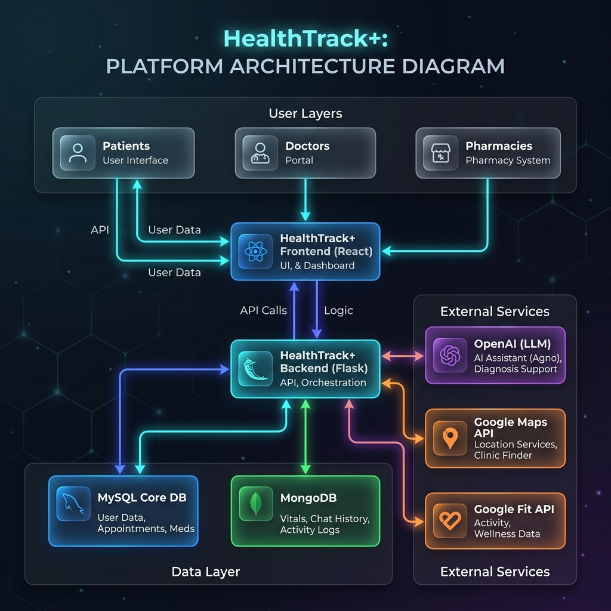

# 🧬 HealthTrack+

### *The Next-Generation Unified Health Operating System*

  
  
  

  
  
  
  
  
  

 

> **Breaking down the silos of modern healthcare.**
> HealthTrack+ is a seamless,  ternary ecosystem connecting Patients, Doctors, and Pharmacies through a single, real-time data grid — built as a Major Industry Ready Project.

---

## 🌌 The Vision

Traditional healthcare systems fragment data across disconnected platforms — a patient's reports are in one system, prescriptions in another, and vitals live on a smartwatch that talks to nothing.

**HealthTrack+** replaces these silos with a cohesive **Health OS**. It synchronises diagnostic reports, real-time prescription routing, role-aware AI chat assistance, and live smartwatch vitals into a single, role-aware unified interface — reducing friction and accelerating patient care at every step.

---

## ✨ Feature Showcases

### 🤖 HealthTrack+ Assistant (AI Agent)

| Feature | Description |
| :---: | :--- |
| 🧑‍💼 **Role-Aware Context** | Instantly adapts its persona for Visitors, Patients, Doctors, and Pharmacists |
| 🛠️ **Tool Calling** | Securely performs actions like checking medicine stock or finding nearby hospitals |
| 🧠 **Memory & Continuity** | Stores session history in MongoDB for continuous, intelligent conversations |
| 🛡️ **Rate Limiting** | Protected against abuse with multi-layered API limits |

### 🧑‍⚕️ Patient Portal

| Feature | Description |
| :---: | :--- |
| 📊 **Smart Dashboard** | Aggregates health history, upcoming appointments, and active prescriptions in one glance |
| 📅 **Book Appointments** | Premium doctor-selection UI with live availability, specialisation filtering, and modal-based booking |
| 🗺️ **Find Hospital** | Discover and navigate to nearby hospitals. Integrates Google Maps with an ultra-fast NumPy-vectorized Haversine search matching 50,000+ records in ~1–3 ms and a lightweight regex-based location parser |
| 💊 **Prescription Wallet** | Digitally store and view prescriptions; transfer to any pharmacy via dynamic QR code |
| ⌚ **Wearable Sync** | Google Fit OAuth2 integration — pulls heart rate, steps, calories, and sleep data with 30-day trend charts |

### 🩺 Doctor Portal

| Feature | Description |
| :---: | :--- |
| 📋 **Patient Timeline** | Complete historical health records, diagnostic reports, and prior prescriptions per patient |
| 📝 **Smart Prescribing** | Write prescriptions with real-time pharmacy inventory checks — prescribe only what is in stock |
| 🤝 **Pharmacy Collaboration** | Form verified partnerships with local pharmacies; route prescriptions directly to their dispense queue |
| 📈 **Statistics & Analytics** | Appointment trends, patient demographics, and clinical performance dashboards |
| 👤 **Profile Management** | Doctor profile, specialisation, and availability settings |

### 💊 Pharmacy Portal

| Feature | Description |
| :---: | :--- |
| 📦 **Live Inventory** | Real-time medicine stock management with automated low-stock alerts |
| 🖨️ **Dispense Queue** | Prescriptions flow in instantly from connected doctors; one-click dispensing with auto stock deduction |
| 🤝 **Doctor Collaboration** | Accept/reject collaboration requests from practitioners and manage active clinical networks |
| 📊 **Pharmacy Dashboard** | Revenue tracking, dispense history, and inventory analytics |
---

### Tech Stack at a Glance

| Layer | Technology | Role |
| :--- | :--- | :--- |
| **Frontend** | React 18, Vite, Vanilla CSS | SPA with role-based routing, glassmorphism UI |
| **Backend** | Python 3, Flask, Flask-JWT-Extended | REST API, RBAC, business logic |
| **Primary DB** | MySQL | Patients, doctors, prescriptions, appointments |
| **Secondary DB** | MongoDB | Google Fit OAuth tokens & time-series health metrics, Agno AI Chat Assistant session history |
| **AI / NLP** | OpenAI Models (`gpt-4o-mini` / `gpt-5.4`), Custom Regex NLP | Chat assistant reasoning, lightweight location query parsing |
| **PDF** | fpdf2 | Prescription PDF generation |
| **Maps** | Google Maps JavaScript API | Hospital finder with live geolocation |
| **Wearables** | Google Fit REST API (OAuth 2.0) | Heart rate, steps, calories, sleep tracking |
| **Agent Framework**| Agno (formerly Phidata) | Orchestrating the AI Chat Assistant and its tools |

---

## 🏗️ System Architecture

### Visual Diagram

### Native Mermaid Flowchart

![System Architecture Flowchart](https://mermaid.ink/img/Z3JhcGggVEQKICAgIHN1YmdyYXBoIEZyb250ZW5kIFtGcm9udGVuZCBMYXllciAtIFJlYWN0ICsgVml0ZV0KICAgICAgICBQW1BhdGllbnQgUG9ydGFsXQogICAgICAgIERbRG9jdG9yIFBvcnRhbF0KICAgICAgICBQaFtQaGFybWFjeSBQb3J0YWxdCiAgICAgICAgQ2hhdFtBSSBBc3Npc3RhbnQgQnViYmxlXQogICAgZW5kCgogICAgc3ViZ3JhcGggQmFja2VuZCBbQmFja2VuZCBMYXllciAtIEZsYXNrIFJFU1QgQVBJXQogICAgICAgIEF1dGhbQXV0aCAmIFJCQUNdCiAgICAgICAgQ29yZVtDb3JlIEFQSSAmIFNlcnZpY2VzXQogICAgICAgIEFJX0FnZW50W0Fnbm8gQUkgQ2hhdCBBZ2VudF0KICAgICAgICBXZWFyW0dvb2dsZSBGaXQgSW50ZWdyYXRvcl0KICAgIGVuZAoKICAgIHN1YmdyYXBoIERhdGFiYXNlcyBbRGF0YSBQZXJzaXN0ZW5jZV0KICAgICAgICBNeVNRTFsoIk15U1FMIENvcmUgRGF0YSIpXQogICAgICAgIE1vbmdvWygiTW9uZ29EQiBOb1NRTCIpXQogICAgZW5kCgogICAgc3ViZ3JhcGggRXh0ZXJuYWwgW0V4dGVybmFsIEludGVncmF0aW9uc10KICAgICAgICBMTE1bT3BlbkFJIEFQSV0KICAgICAgICBHb29nbGVNYXBzW0dvb2dsZSBNYXBzIEFQSV0KICAgICAgICBHb29nbGVGaXRbR29vZ2xlIEZpdCBBUEldCiAgICBlbmQKCiAgICBQIC0tPiBBdXRoCiAgICBEIC0tPiBBdXRoCiAgICBQaCAtLT4gQXV0aAogICAgCiAgICBQIC0uLT4gQ2hhdAogICAgRCAtLi0-IENoYXQKICAgIFBoIC0uLT4gQ2hhdAogICAgCiAgICBDaGF0IC0tPiBBSV9BZ2VudAogICAgQUlfQWdlbnQgLS0-IExMTQogICAgQUlfQWdlbnQgLS4tPiBNb25nbwoKICAgIEF1dGggLS0-IENvcmUKICAgIENvcmUgLS0-IE15U1FMCiAgICAKICAgIFAgLS0-IFdlYXIKICAgIFdlYXIgLS0-IEdvb2dsZUZpdAogICAgV2VhciAtLi0-IE1vbmdvCiAgICAKICAgIFAgLS0-IEdvb2dsZU1hcHM=)

---

## 👥 The Team

Made with ❤️ by **Team `getch();`**

*Building tomorrow's healthcare infrastructure, today.*

---

HealthTrack+ · Academic Project 

